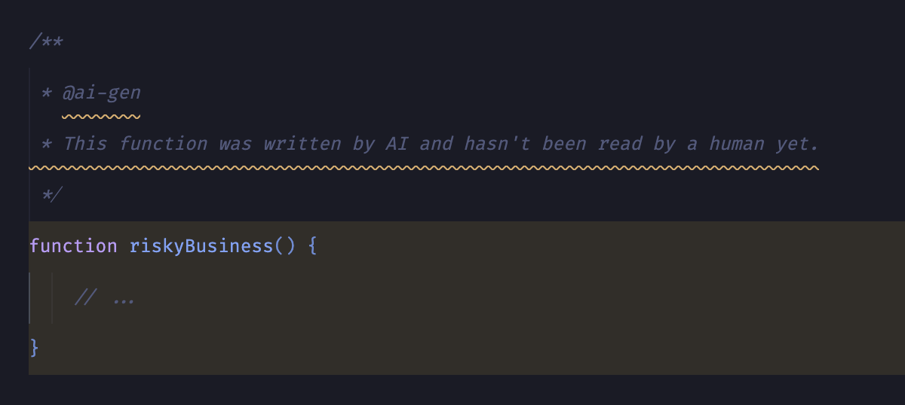
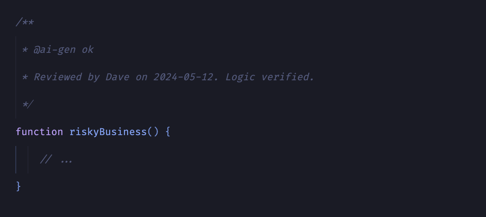

  

<h1 align="center">Ack-AI</h1>

  <strong>Acknowledge your AI-generated code before it hits production.</strong>

Ack-AI is a VS Code extension that enforces a "Human-in-the-Loop" workflow. It scans your source code for AI generation tags and highlights them with a warning until a human developer explicitly acknowledges ("acks") them.

## Why Ack-AI?

AI coding assistants (Copilot, ChatGPT, Claude) are powerful, but they can introduce subtle bugs or security hallucinations.
**Ack-AI** ensures that no AI-generated code remains in your codebase without a human explicitly "signing off" on it.

It turns the `@ai-gen` tag into a **mandatory review checkpoint**.

## Features

*   **Real-time Monitoring:** Instantly detects `@ai-gen` tags in your code.
*   **Visual Warning:** Highlights unverified AI code with a **Warning** squiggly line.
*   **The "Ack" Workflow:** The warning persists until you append `ok` to the tag.
*   **Context Aware:** Highlights not just the comment, but the entire code block (function/class body) following it.
*   **File-level Tags:** Add `// @ai-gen` at the top of a file to mark the entire file as AI-generated.
*   **Multi-language Support:** Works with 25+ programming languages using language-appropriate comment syntax.

## How it Works

### 1. The Warning State
When you paste or generate code with the tag `@ai-gen`, Ack-AI flags it immediately.

  

### 2. The Acknowledged State
To clear the warning, you must review the code and explicitly "Ack" it by adding `ok` to the tag.

  

## Supported Languages

Ack-AI supports a wide range of programming languages:

### C-style comments (`/** */` and `//`)
*   **JavaScript** (`.js`, `.jsx`, `.mjs`, `.cjs`)
*   **TypeScript** (`.ts`, `.tsx`, `.mts`, `.cts`)
*   **PHP** (`.php`)
*   **Java** (`.java`)
*   **C/C++** (`.c`, `.cpp`, `.h`, `.hpp`)
*   **C#** (`.cs`)
*   **Go** (`.go`)
*   **Rust** (`.rs`)
*   **Swift** (`.swift`)
*   **Kotlin** (`.kt`, `.kts`)
*   **Scala** (`.scala`)
*   **Dart** (`.dart`)
*   **Groovy** (`.groovy`)
*   **Objective-C** (`.m`, `.mm`)

### Python docstrings (`"""` and `'''`) and hash comments (`#`)
*   **Python** (`.py`)

### Hash comments (`#`)
*   **Ruby** (`.rb`)
*   **Shell/Bash** (`.sh`, `.bash`, `.zsh`)
*   **Perl** (`.pl`, `.pm`)
*   **R** (`.r`, `.R`)
*   **YAML** (`.yml`, `.yaml`)
*   **Dockerfile**
*   **Makefile**
*   **CoffeeScript** (`.coffee`)
*   **PowerShell** (`.ps1`)
*   **Elixir** (`.ex`, `.exs`)

## Configuration

No configuration needed! Just install and start reviewing.

*   **Trigger:** `@ai-gen`
*   **Safe Keywords:** `ok` (Case insensitive)
*   **Rejected Keywords:** `rejected`, `reject` (marks code as explicitly rejected)

## Installation

1.  Open **VS Code**.
2.  Press `F1`, type `ext install`, and search for **Ack-AI**.
3.  Click **Install**.

---

*Always verify.*